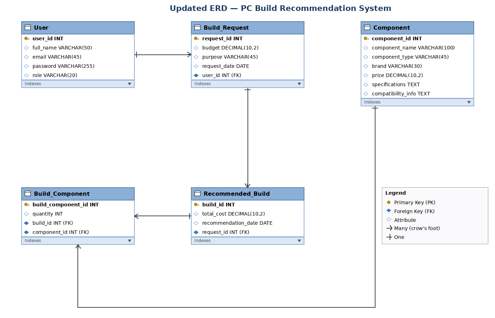

# Normalization Document

**Project:** PC Build Recommendation System (Web-Based)
**Milestone:** 2 — ERD Design & Normalization
**Group Members:** Umer Daraz, Habib, Kashif

---

## Overview

This document records the normalization process applied to the database schema for the PC Build Recommendation System. Each table was reviewed in sequence against First Normal Form (1NF), Second Normal Form (2NF), and Third Normal Form (3NF). For every table and every normal form, a justification is provided — including for cases where no change was required.

The full write-up with detailed table definitions is in `milestone_no_2.docx`. The updated ER diagram is in `updated_erd.png`.

---

## Version History

| Milestone | Version | Remarks |
|-----------|---------|---------|
| ERD Schema | 1.0 | Approved |
| ERD Schema (Normalized) | 1.1 | Changes accommodated |
| Normalization Document | 2.0 | 1NF / 2NF / 3NF applied to all tables |

---

## Step 1 — Normalization Summary

### 1. User
- **1NF:** No issue. All attributes atomic; each user uniquely identified by `user_id`.
- **2NF:** No issue. Single-column primary key, so no partial dependency is possible. All attributes depend fully on `user_id`.
- **3NF:** No issue. No non-key attribute depends on another non-key attribute (`role`, `email`, `password`, `full_name` are all directly determined by `user_id`).

### 2. Build_Request
- **1NF:** No issue. All attributes atomic; each request uniquely identified by `request_id`.
- **2NF:** No issue. Single-column primary key. All attributes depend fully on `request_id`.
- **3NF:** No issue. `budget` does not depend on `purpose`, and `purpose` does not depend on `user_id`. No transitive dependency.

### 3. Component
- **1NF:** No issue. All hardware attributes (`brand`, `price`, `specifications`, etc.) are atomic.
- **2NF:** No issue. Single-column primary key. All attributes depend fully on `component_id`.
- **3NF:** No issue. `brand` does not determine `price`, and `component_type` does not determine `specifications`. No transitive dependency.

### 4. Recommended_Build
- **1NF:** **Issue found.** The original table included `component_id`, which meant a single build with multiple components would either need a multi-valued field (violating atomicity) or duplicate the entire build row per component (a repeating group).
  - **Change:** Removed `component_id` from `Recommended_Build` and introduced a separate `Build_Component` junction table.
  - **Why:** To eliminate the repeating group and properly model the many-to-many relationship between builds and components.
- **2NF:** No issue after 1NF correction. All remaining attributes (`total_cost`, `recommendation_date`, `request_id`) depend fully on `build_id`.
- **3NF:** No issue. `total_cost` is independent of `recommendation_date`; no transitive dependency.

### 5. Build_Component (new junction table)
- **1NF:** No issue. Each row stores one component for one build with a single quantity. All values atomic.
- **2NF:** No issue. Surrogate primary key `build_component_id` — partial dependency impossible. All attributes depend fully on it.
- **3NF:** No issue. `quantity` is determined only by the (build, component) combination, fully represented through the primary key. Foreign keys introduce no transitive dependencies.

---

## Step 2 — Removing Duplicates

**Redundancies found:**
- `Recommended_Build` previously contained `component_id`, causing the entire build row (with `total_cost`, `recommendation_date`, `request_id`) to repeat for every component in a build.

**Actions taken:**
- Removed `component_id` from `Recommended_Build`.
- Added a new `Build_Component` table containing `build_id` and `component_id` as foreign keys plus a `quantity` column.
- Verified no attribute is stored in more than one table. Foreign keys reference parent tables; data is never copied.

**Result:** No repeating groups, no duplicated data across rows, no overlapping attributes. Every fact is stored in exactly one place.

---

## Step 3 — Updated ERD

The ER diagram has been updated to reflect all normalization changes.

**Key changes in the updated ERD:**
- `component_id` removed from `Recommended_Build`.
- `Build_Component` now contains `component_id` as a foreign key to `Component`.
- A new relationship line connects `Build_Component` to `Component`.
- All cardinalities (one / many) shown using crow's-foot notation.

### Relationship Summary

| Relationship | Type | Description |
|---|---|---|
| User → Build_Request | One-to-Many | One user can submit many build requests |
| Build_Request → Recommended_Build | One-to-Many | One build request can generate multiple recommended builds |
| Recommended_Build → Build_Component | One-to-Many | One recommended build can include many component entries |
| Component → Build_Component | One-to-Many | One component can appear in many build entries |
| Recommended_Build ↔ Component (via Build_Component) | Many-to-Many | Resolved through the `Build_Component` junction table |

---

## Final Schema (after normalization)

**User** (`user_id` PK, `full_name`, `email` UNIQUE, `password`, `role`)

**Build_Request** (`request_id` PK, `budget`, `purpose`, `request_date`, `user_id` FK → User)

**Component** (`component_id` PK, `component_name`, `component_type`, `brand`, `price`, `specifications`, `compatibility_info`)

**Recommended_Build** (`build_id` PK, `total_cost`, `recommendation_date`, `request_id` FK → Build_Request)

**Build_Component** (`build_component_id` PK, `quantity`, `build_id` FK → Recommended_Build, `component_id` FK → Component)

---

## Files in this Milestone

- `NORMALIZATION.md` — this document
- `milestone_no_2.docx` — full milestone deliverable
- `updated_erd.png` — updated ER diagram (version 1.1)
